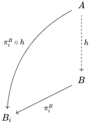

## 6. Exemplos de Topologias: Ordem, Métrica, Produto e Quociente

### Exercício 6.2

**Questão:** Seja $(M_i, \tau_i)_{i \in I}$ uma família de espaços topológicos. Mostre que cada $M_i$ é homeomorfo a um subespaço de $M$.

**Resolução:** 

1. Construir subespaço de $M$ e função de projeção.
   - Fixemos $z \in M$ e definamos $$Y_i = \{ x \in M : x_j = z_j, ~ \forall~j \in I \setminus \{ i \} \}$$
   - Seja $p_i = \pi_i|_{Y_i}$. Note que $p_i(y) = y_i$ para todo $y \in Y_i$. Mostraremos que $p_i$ é homeomorfismo entre $Y_i$ e $M_i$.

2. Mostrar que $p_i$ é injetora.
   - Sejam $x, y \in Y_i$. Para todo $j \in I \setminus \{ i \}$, temos que $x_j = z_j = y_j$. 
   - Caso $p_i(x) = p_i(y)$, temos que $x_i = y_i$. Portanto, $x = y$.

3. Mostrar que $p_i$ é sobrejetora.
   - Seja $x_i \in M_i$. Tomando $y \in Y_i$, para todo $j \in I$ temos
   $$
   y_j = \begin{cases}
      z_j, & j \neq i \\
      x_i, & j = i
   \end{cases}
   $$
   - Portanto, $x_i = y_i = p_i(y)$ e $p_i$ é sobrejetora.

4. Mostrar que $p_i$ é contínua.
   - Como $p_i$ é restrição de função contínua, temos que $p_i$ é contínua.

5. Mostrar que $p_i$ é mapa aberto.
   - Seja $U$ aberto de $Y_i$. Como $Y_i$ é subespaço de $M$, existe aberto $V$ de $M$ tal que $U = V \cap Y_i$.
   - Da topologia produto, temos que existe $J \subset I$ finito tal que 
   $$
   V = \bigcap_{j \in J} \pi_j^{-1}(V_j), \quad V_j \text{ aberto em } M_j 
   $$
   - Assim,
      $$
      p_i(V \cap Y_i) = \bigcap_{j \in J}p_i(\pi_j^{-1}(V_j) \cap Y_i)
      $$
      é aberto em $M_i$.

### Exercício 6.7

**Questão:** Seja $\mathbb{R}^\infty$ o subconjunto de $\mathbb{R}^\omega$ consistindo de elementos $(x_1, x_2, \ldots)$ em que somente um número finito de $x_i$'s é diferente de zero. Determine o fecho de $\mathbb{R}^\infty$ na topologia produto e na topologia das caixas.

**Resolução:** 

1. Topologia produto.
   - Observe que um aberto de $\mathbb{R}^\omega$ é da forma 
      $$
         U = U_1 \times \cdots U_n \times \mathbb{R} \times \mathbb{R} \times \cdots
      $$
      em que cada $U_i$ é aberto em $\mathbb{R}$.
   - Seja $x \in \mathbb{R}^\omega$ e $U$ um aberto (como acima) em volta de $x$. 
   - Se $y$ é da forma $y = (x_1, x_2, \ldots, x_n, 0, 0, \ldots)$, temos que $y \in U$ e $y \in \mathbb{R}^\infty$.
   - Isso mostra que $\mathbb{R}^\infty$ é denso em $\mathbb{R}^\omega$. Ou seja, $\overline{\mathbb{R}^\infty} = \mathbb{R}^\omega$.

2. Topologia das caixas.
   - Aqui, um aberto de $\mathbb{R}^\omega$ é da forma
      $$
         V = V_1 \times \cdots \times V_k \times \cdots
      $$
      em que cada $V_i$ é aberto em $\mathbb{R}$.
   - Tomemos $x \notin \mathbb{R}^\infty$, i.e., $x_n \neq 0$, para infinitos índices $n$.
   - Assim, se 
      $$
      V_i = \begin{cases}
         (x_i - |x_i|/2, ~x_i + |x_i|/2), & x_i \neq 0 \\
         (-1, 1), & x_i = 0
      \end{cases}
      $$
      então $x \in V = \prod V_i$ e $V \cap \mathbb{R}^\infty = \emptyset$.
   - Logo, $\mathbb{R}^\infty$ é fechado na topologia das caixas.

### Exercício 6.11

**Questão:** Prove que as projeções canônicas em $\mathbb{R}^2$ não são funções fechadas.

**Resolução:**

Considere $$F = \{ (x, y) \in \mathbb{R}^2 : y \ge 1/x \}$$ Então $F$ é fechado, mas $\pi_1(F) = (0, \infty)$ é aberto.

<!-- ### Exercício 6.12

**Questão:** Mostre que a topologia da ordem é Hausdorff

**Resolução:**  -->

### Exercício 6.13

**Questão:** Mostre que um espaço é Hausdorff sse. a diagonal $\Delta = \{ (x, x) : x \in X \}$ é fechada em $X \times X$.

**Resolução:** 

1. $(\Rightarrow)$ Seja $(x,y) \in \Delta^c$. Como $X$ é Hausdorff, existem $U$ e $V$ abertos com $x \in U$ e $y \in V$ tais que $U \cap V = \emptyset$. Logo, $(x, y) \in U \times V \subset \Delta^c$.

2. $(\Leftarrow)$ Seja $(x,y) \in \Delta^c$ (aberto, por hipótese). Então existe $U \times V$ aberto tais que $(x,y) \in U \times V \subset \Delta^c$. Assim, $x \in U$ e $y \in V$ com $U \cap V = \emptyset$. Logo, $X$ é Hausdorff.

### Exercício 6.14

**Questão:** Seja $(M_i, \tau_i)_{i \in \Lambda}$ uma família de espaços topológicos. Suponha que existe $\Delta \subset \Lambda$ não vazio tal que $M_i$ é trivial para todo $i \in \Lambda \setminus \Delta$. Mostre que $\prod_{i \in \Delta} M_i$ é homeomorfo a $\prod_{i \in \Lambda} M_i$.

**Resolução:** 

Fixe $x_i \in M_i$ e defina 
$$
\begin{aligned}
\varphi : \prod_{j \in \Delta} M_j &\longrightarrow \prod_{j \in \Lambda} M_j \\
(z_j) &\longmapsto (y_j)
\end{aligned}
$$
em que 
$$
y_j = \begin{cases}
z_j, & j \in \Delta \\
x_j, & j \in \Lambda \setminus \Delta
\end{cases}
$$

Note que $\varphi$ e $\pi$ são inversas.

### Exercício 6.15

**Questão:** Assuma que, para todo $i \in I$ temos que $a_i < b_i$. Mostre que $\prod_{i \in I} [a_i, b_i]$ é homeomorfo a $[0,1]^I$.

**Resolução:** 

- Sabemos que todo intervalo fechado $[a,b]$ é homeomorfo a $[0,1]$. 

- Sejam $A_i$ e $B_i$ espaços topológicos tais que cada $h_i : A_i \longrightarrow B_i$ é homeomorfismo, para todo $i \in I$.

- Construímos $$h : A = \prod_{i \in I} A_i \longrightarrow B = \prod_{i \in I} B_i$$ dado por $h((x_i)) = (h_i(x_i))$. 

- Verificar que $h$ é bijeção.

- Como $\pi_i^B \circ h = h_i \circ \pi_i^A$ é contínua, segue da propriedade universal do produto que $h$ é contínua. Analogamente (invertendo $A$ e $B$ no diagrama), temos que $h^{-1}$ é contínua. 

- Logo, $h$ é homeomorfismo e, com isso, temos que $\prod_{i \in I} [a_i, b_i]$ é homeomorfo a $\prod_{i \in I} [0,1] = [0,1]^I$.

**Propriedade universal do produto:** Para todo espaço topológico $A$ e toda função $h : A \longrightarrow B$, temos que $h$ é contínua sse. para cada $i \in I$ temos que a componente $\pi_i \circ h : A \longrightarrow B_i$ é contínua.

<!-- https://q.uiver.app/#q=WzAsMyxbMiwwLCJBIl0sWzIsMiwiQiJdLFswLDMsIkJfaSJdLFswLDEsImgiXSxbMSwyLCJcXHBpX2leQiJdLFswLDIsIlxccGlfaV5CIFxcY2lyYyBoIiwyLHsiY3VydmUiOjMsInN0eWxlIjp7ImJvZHkiOnsibmFtZSI6ImRhc2hlZCJ9fX1dXQ== -->

### Exercício 6.17

**Questão:** Seja $X$ um espaço de Tychonoff. Mostre que, para cada $f \in \mathcal{C}_b(X)$ existe $\tilde{f} \in \mathcal{C}_b(\beta X)$ tal que $f = \tilde{f} \circ \varphi$.

**Resolução:** 

1. Tomemos $a \in \beta X$. Podemos escrever $a = (a_\varphi)_{\varphi \in \mathcal{C}_b(X)}$. 
2. Defina $\tilde{f}(a) = a_f$. Vejamos que $\tilde{f}$ estende $f$.
3. Seja $x \in X$. Então $\varphi(x) = (f(x))_{f \in \mathcal{C}_b(X)}$. Assim, $\tilde{f}(\varphi(x)) = f(x)$, como queríamos.
4. Note que $\tilde{f}$ é contínua pois $\tilde{f} = \pi_f$. 

*Outra forma:* De fato, basta considerar $\tilde{f} = \pi_f : \prod_{g \in \mathcal{C}_b(X)} I_g \longrightarrow I_f$. Então $f = \pi_f \circ \varphi$.

<!-- ### Exercício 6.18

**Questão:** Sejam $X$ e $Y$ dois espaços de Tychonoff. Mostre que para cada função contínua $h : X \longrightarrow Y$, existe uma função contínua $\tilde{h} : X \longrightarrow Y$ tal qe o seguinte diagrama comuta:

**Resolução:** 

Notas de aula (Teorema 27), Willard, Thm. 19.5. -->

<!-- ### Exercício 6.20

**Questão:**

**Resolução:** 

Ver https://math.stackexchange.com/questions/4713064/l-infty-and-stone-cech-compactification-of-mathbbn -->

### Exercício 6.21

**Questão:** Mostre que:

1. $\mathbb{N}$ é aberto em $\beta \mathbb{N}$.

2. Cada $n \in \mathbb{N}$ é ponto isolado em $\beta \mathbb{N}$, i.e., $\{ n \}$ é aberto em $\beta \mathbb{N}$.

3. Os únicos pontos isolados em $\beta \mathbb{N}$ são os pontos de $\mathbb{N}$.

**Resolução:** 

1. $\mathbb{N}$ é aberto em $\beta \mathbb{N}$.
   
   Pelo exercício 34 da lista de funções contínuas, $\varphi(\mathbb{N})$ é aberto em $\beta \mathbb{N}$ sse. $\mathbb{N}$ é localmente compacto. Como $\mathbb{N}$ é localmente compacto, temos o resultado.

2. Cada $n \in \mathbb{N}$ é ponto isolado em $\beta \mathbb{N}$, i.e., $\{ n \}$ é aberto em $\beta \mathbb{N}$.
   - Sabemos que a inclusão $\iota : A \hookrightarrow B$ é um mapa aberto sse. $A$ é aberto em $B$.
   - Como $\mathbb{N}$ é aberto em $\beta \mathbb{N}$, temos que $\iota : \mathbb{N} \hookrightarrow \beta \mathbb{N}$ é mapa aberto. 
   - Assim, visto que $\{ n \}$ é aberto em $\mathbb{N}$, segue que $\{ n \}$ é aberto em $\beta \mathbb{N}$.

3. Os únicos pontos isolados em $\beta \mathbb{N}$ são os pontos de $\mathbb{N}$.
   
   Seja $s \in \beta \mathbb{N}$ e suponha $\{ s \}$ aberto. Então, $$\{ s \} \cap \varphi(\mathbb{N}) \neq \emptyset \implies s \in \varphi(\mathbb{N})$$ pois se $s \in \overline{\varphi(\mathbb{N})}$, então $U_s \cap \varphi(\mathbb{N}) \neq \emptyset$ para toda vizinhança $U_s$ de $s$.

### Exercício 6.22

**Questão:** Seja $M$ um espaço de Tychonoff e $(N, \varphi)$ uma compactificação de $M$ com a seguinte propriedade: dados um espaço de Hausdorff compacto $H$ e uma função contínua $f : M \longrightarrow H$, existe uma única funçao contínua tal que $f : N \longrightarrow H$ tal que $\tilde{f} \circ \varphi = f$.

Mostre que existe homeomorfismo $\tilde{\varphi} : \beta M \longrightarrow N$.

**Resolução:** 

- Seja $\iota_1 : M \longrightarrow \beta M$ a inclusão. Como existe $f : \beta M \longrightarrow N$ extensão contínua de $\iota_1$. 

- Considere também $\iota_2 : M \longrightarrow \beta M$ inclusão. Então existe $g : N \longrightarrow \beta M$ extensão contínua de $\iota_2$.

- Note que $f \circ g : Y \longrightarrow Y$ e $g \circ f : \beta M \longrightarrow \beta M$ são contínuas e $f \circ g |_X = g \circ f |_X = \text{id}_X$. 

- Logo, como $M$ é denso em $\beta M$, temos que $f$ e $g$ são bijeções contínuas, uma a inversa da outra.

### Exercício 6.24

**Questão:** Seja $(M,d)$ um espaço métrico e defina
$$
\tilde{d}(x,y) = \frac{d(x,y)}{1+d(x,y)}
$$

Mostre que

1. As funções reais $f(t) = \frac{t}{1+t}$ definida em $[0, +\infty)$ e $g(t) = \frac{t}{1-t}$ definida em $[0,1)$ são crescentes.

2. $\tilde{d}$ é uma métrica em $M$ que define os mesmos abertos que $d$.

**Resolução:** 

1. Funções crescentes.
   
   Sejam $x_0 < x_1 \in [0, +\infty)$. Basta notar que
   $$
   f'(t) = \frac{1}{(1+t)^2} > 0
   $$
   implica que $f$ é crescente.

2. Métricas equivalentes.
   - Note que $\tilde{d}(x,y) \le d(x,y)$. 
   - Dado $a \in M$ e $\varepsilon > 0$, tome $\delta = \frac{\varepsilon}{1+\varepsilon}$. Então
   $$
   \tilde{d}(x,a) < \delta \implies \frac{d(x,a)}{1+d(x,a)} < \frac{\varepsilon}{1+\varepsilon} \implies d(x,a) < \varepsilon \implies B_{\tilde{d}}(x,a) \subset B_d(x,a)
   $$
   - Assim, temos que $B_d \subset B_{\tilde{d}}$ e $B_{\tilde{d}} \subset B_d$. Logo, as métricas são equivalentes.

### Exercício 6.25

**Questão:** Mostre que para cada $p \ge 1$ a função
$$
d_p(x,y) = \sqrt[p]{\sum_{i=1}^n |x_i - y_i|^p}
$$
define uma métrica que induz a topologia usual de $\mathbb{R}^n$. Como são os elementos da base da topologia para $n=2$ e $p=1$.

**Resolução:** 

Observe que, se $d$ é a métrica euclidiana,
$$
d(x,y) \le d_p(x,y) \le \sqrt[p]{n}d(x,y)
$$

Assim, temos que
$$
B_{d_p}(x, \varepsilon) \subset B_d(x, \varepsilon) \quad \text{ e } \quad B_d(x, \varepsilon/\sqrt[p]{n}) \subset B_{d_p}(x, \varepsilon)
$$

Portanto, a topologia induzida por $d_p$ é a mesma topologia induzida por $d$. Logo, $d_p$ induz a topologia usual.

Os elementos básicos para $n=2$ e $p=1$ são losangos. 

### Exercício 6.26

**Questão:** Seja $(X, d)$ um espaço métrico. Mostre que a topologia induzida por $d$ é a menor topologia que faz $d$ ser uma função contínua.

**Resolução:** 

1. Seja $X'$ um espaço topológico sobre o mesmo conjunto $X$, mas com outra topologia. E suponha que $d : X' \times X' \longrightarrow \mathbb{R}$ é contínua. 
2. Assim, para todo $x \in X'$, a função $f(y) = d(x,y)$ é contínua.
3. Com isso, temos que as bolas em $X'$ dadas por $$B_r(x) = \{ y \in X' : f(y) = d(x,y) < r \}$$ são abertas em $X'$.
4. Como as bolas abertas formam uma base pra topologia de $X$, temos que todo aberto de $X$ é aberto em $X'$. Portanto, a topologia em $X'$ é mais fina que a topologia de $X$.

### Exercício 6.27, 6.28, 6.29

**Questão:** Mostre que todo espaço métrico $(M,d)$ é $T_4$.

**Resolução:** 

1. Mostremos que $M$ é $T_1$.
   - Sejam $x, y \in M$ e $r = d(x,y)$.
   - Tomemos
   $$
   U = B(x, r/3), \quad V = (y, r/3)
   $$
   - Então $x \in U$, $x \in V^c$, $y \in V$ e $y \in U^c$.

2. Mostremos que $M$ é normal.
   - Definimos para $A \subset M$ fechado
   $$
   d(x,A) = \inf_{y \in A} d(x,y) = f(x)
   $$
   - Temos que $f$ é contínua.
      - De fato, para todo $a \in A$, 
      $$
      d(x,a) \le d(x,y) + d(y,a) \implies d(x,A) \le d(x,y) + d(y,A)
      $$
      - Analogamente,
      $$
      d(y,A) \le d(x,y) + d(x,A)
      $$
      - Portanto,
      $$
      |f(x) - f(y)| \le d(x,y) 
      $$
      - O que mostra a continuidade.
   - Defina, para $A, B \subset M$ fechados disjuntos
   $$
   g(x) = \frac{d(x,A)}{d(x,B) + d(x,A)}
   $$
   - Note que, se $A^c \cap B^c = \emptyset$, então $A^c$ e $B^c$ são fechados e, assim, $A$ e $B$ são abertos que separam $A$ e $B$.
   - Caso $A^c \cap B^c \neq \emptyset$, observe que
   $$
   d(x,B) + d(x,A) = 0 \implies d(x,B) = 0 \quad \text{ e } \quad d(x,A) = 0
   $$
   - Assim, $x$ é ponto de aderência de $A$ e $B$, o que implica que $x \in A \cap B = \emptyset$, o que é absurdo. 
   - Com isso, temos que $g$ é contínua.
   - Observe que $g(A) \subset \{ 0 \}$ e $g(B) \subset \{ 1 \}$. 
   - Tomando $U = g^{-1}(-\infty, 1/3)$ e $V = g^{-1}(2/3, +\infty)$, temos que $A \subset U$, $B \subset V$ e $U \cap V = \emptyset$.

<!-- Feito em aula (p. 75). Willard Ex. 15.3c. -->

### Exercício 6.30

**Questão:** Seja $$\rho(x,y) = \sup_{n \in \mathbb{N}} \min \{ |x_n - y_n|, ~1  \}, \quad x = (x_n), ~y = (y_n) $$ a métrica uniforme em $\mathbb{R}^\omega$. Dado $x = (x_1, x_2, \ldots) \in \mathbb{R}^\omega$ e $0 < \varepsilon < 1$, considere $$U(x, \varepsilon) = \prod (x_i - \varepsilon, ~x_i + \varepsilon)$$

1. Mostre que $U(x, \varepsilon) \neq B_\rho(x, \varepsilon)$.

2. Mostre que $U(x, \varepsilon)$ não é aberto na topologia uniforme.

3. Mostre que  $$B_\rho(x, \varepsilon) = \bigcup_{\delta < \varepsilon} U(x, \delta)$$

**Resolução:** 

1. $U(x, \varepsilon) \neq B_\rho(x, \varepsilon)$.
   - Temos que que $U(x, \varepsilon) \subset B_\rho(x, \varepsilon)$, mas não o contrário. Considere, por exemplo, o ponto $x' = \left( x_n + \varepsilon - \frac{\varepsilon}{n} \right)_{n \in \mathbb{N}}$. 
   - De fato, 
   $$
   \rho(x,x') = \sup_{n \in \mathbb{N}} \min \left\{ \left|x_n - x_n + \varepsilon - \frac{\varepsilon}{n} \right|, ~1  \right\} = \sup_{n \in \mathbb{N}} \left|\varepsilon \left( 1 - \frac{1}{n} \right) \right| = \varepsilon
   $$
   - Por outro lado, 
   $$
   \left|x_n - x_n + \varepsilon - \frac{\varepsilon}{n} \right| = \varepsilon \left( 1 - \frac{1}{n} \right) < \varepsilon \implies x_n + \varepsilon \left( 1 - \frac{1}{n} \right) \in (x_n - \varepsilon, ~x_n + \varepsilon)
   $$
   - Logo, $x' \in U(x, \varepsilon)$, mas $x' \notin B_\rho(x, \varepsilon)$.

2. Mostre que $U(x, \varepsilon)$ não é aberto na topologia uniforme.
   - Vamos mostrar que não existe nenhuma bola aberta $B_\rho(x', \delta)$ contida em $U(x, \varepsilon)$.

   - Note que não importa quão pequeno seja $\delta > 0$, temos que $B_\rho(x', \delta) \setminus U(x, \varepsilon) \neq \emptyset$. Isso porque $x_k' + \delta/2 > x_k + \varepsilon$ para $k$ suficientemente grande.

3. Mostre que  $$B_\rho(x, \varepsilon) = \bigcup_{\delta < \varepsilon} U(x, \delta)$$
   - Tome $y \in B_\rho(x, \varepsilon)$.
   - Então $\rho(x, x') = \delta < \varepsilon$ e $|x_n - y_n| \le \delta < \frac{\delta+\varepsilon}{2} < \varepsilon$ para todo $n \in \mathbb{N}$. Portanto, $y \in U \left(x, \frac{\delta+\varepsilon}{2} \right)$.
   - Por outro lado, se $y \in B_\rho(x, \varepsilon)$, então $y \in U(x, \delta)$ para algum $\delta \in (0, \varepsilon)$. Portanto, $|x_n - y_n| < \delta$ para todo $n \in \mathbb{N}$. Assim,
   $$
   \rho(x,y) = \sup_{n \in \mathbb{N}} |x_n - y_n| \le \delta < \varepsilon \implies y \in B_\rho(x, \varepsilon)
   $$

<!-- https://math.stackexchange.com/questions/71546/the-uniform-metric-on-mathbbr-omega

https://math.stackexchange.com/questions/1242919/prob-6-sec-20-in-munkres-topology-2nd-ed-how-is-this-set-not-open

https://math.stackexchange.com/questions/2719972/show-that-ux-epsilon-is-not-even-open-in-the-uniform-topology -->

### Exercício 6.37

**Questão:** Sejam $(M,d)$ espaço métrico e $A \subset M$ um conjunto fechado. Mostre que toda função contínua $f : A \longrightarrow \mathbb{R}^n$ pode ser estendida a $M \longrightarrow \mathbb{R}^n$. Veja que, em geral, não vale se $A$ é aberto: encontre uma função contínua $f : \mathbb{R} \setminus \{ 0 \} \longrightarrow \mathbb{R}$ que não possa ser estendida.

**Resolução:**

- Seja $\pi_i : \mathbb{R}^n \longrightarrow \mathbb{R}$ a projeção na $i$-ésima coordenada. Como todo espaço métrico é normal, pelo Teorema de Extensão de Tietze, temos que $f_i := \pi_i \circ f$ pode ser extendida de $M$ para $\mathbb{R}$.

- Assim, se $\tilde{f_i}$ é a extensão de $f_i$, temos que a extensão $\tilde{f}$ de $f$ é dada por $(\tilde{f_1}, \ldots, \tilde{f_n})$. 

- Contra-exemplo: Considere $f(x) = 1/x$.

### Exercício 6.40

**Questão:** Mostre que o produto enumerável de espaços metrizáveis é metrizável.

**Resolução:**

1. Tomar métricas limitadas.
   
   Sejam $M_1, M_2, \ldots$ espaços metrizáveis. Como toda métrica é equivalente a uma métrica limitada, seja $d_i$ uma métrica sobre $M_i$ limitada por $1$ que induz a topologia de $M_i$. 

2. Definir métrica $d$ em $M := \prod_{i=1}^\infty M_i$:
   $$
   d(x,y) = \sum_{i=1}^\infty \frac{d_i(x_i, y_i)}{2^i}
   $$
   em que $x = (x_1, x_2, \ldots)$ e $y = (y_1, y_2, \ldots)$.

3. Verificar que $d$ induz a topologia produto em $M$.

   Um aberto básico $U$ na topologia produto restringe apenas uma quantidade finita de coordenadas e assim pode ser escrita como 
   $$
   U = B_{d_1}(x_1, \varepsilon_1) \times B_{d_2}(x_2, \varepsilon_2) \times \cdots \times B_{d_n}(x_n, \varepsilon_n) \times \prod_{k \ge n+1} M_k
   $$

   Tome $\varepsilon$ tal que
   $$
   \varepsilon = \min \left( \frac{\varepsilon_1}{2}, \frac{\varepsilon_2}{2^2}, \ldots, \frac{\varepsilon_n}{2^n} \right)
   $$

   Assim, se $d(x,y) < \varepsilon$, então $d_i(x_i, y_i) < \varepsilon_i$ para todo $i = 1, 2, \ldots, n$. Ou seja, $B_d(x, \varepsilon) \subset U$. 

   Por outro lado, dado $\varepsilon > 0$, escolha $N$ suficientemente grande tal que
   $$
   \sum_{i=N+1}^\infty \frac{1}{2^i} < \frac{\varepsilon}{2}
   $$

   Então,
   $$
   B_{d_1}\left( x_1, \frac{\varepsilon}{2N} \right) \times B_{d_2}\left( x_2, \frac{\varepsilon}{2N} \right) \times \cdots \times B_{d_n}\left( x_n, \frac{\varepsilon}{2N} \right) \times \prod_{k \ge n+1} M_k \subset B_d(x, \varepsilon)
   $$

   Logo, a métrica $d$ induz a topologia produto em $M$.

<!-- Willard, 22.3 (p. 161) -->

### Exercício 6.41

**Questão:** Sejam $X$ e $Y$ dois conjuntos ordenados na topologia da ordem. Mostre que se um mapa $f : X \longrightarrow Y$ é sobrejetor e preserva a ordem, então é um homeomorfismo.

**Resolução:**

- Observe que como $f$ preserva a ordem, então $f$ é injetora. E como $f$ é sobrejetora por hipótese, existe inversa $g : Y \longrightarrow X$.

- Como $f$ preserva a ordem e é bijetora, $g$ também preserva a ordem.

- Chamemos de $L_a = \{ x \in X : x <_X a \}$ e $R_a = \{ x \in X : a <_X x \}$ os abertos básicos da topologia da ordem.

- Como a ordem é preservada por $f$, temos que $f^{-1}[L_a] = L_{g(a)}$. De fato,
$$
x \in f^{-1}[L_a] \iff f(x) <_Y a \iff x = g(f(x)) <_X g(a) \iff x \in L_{g(a)}
$$

- Analogamente, $f^{-1}[R_a] = R_{g(a)}$. Portanto, $f$ ser uma bijeção que preserva a ordem implica que $f$ é contínua. Como o mesmo é válido para $g$, temos que $f$ é homeomorfismo.

### Exercício 6.44

**Questão:** Sejam $(M, \tau)$ e $(N, \tau')$ dois espaços topológicos e $\pi : M \longrightarrow N$ uma aplicação contínua. Mostre que

1. Se existe uma função contínua $\sigma : N \longrightarrow M$ tal que $\pi \circ \sigma(x) = x$ para todo $x \in N$, então $\pi$ é aplicação quociente.

2. Se $\pi$ é aplicação quociente, então $\pi$ é aberta (fechada) sse. $\pi^{-1}(\pi(U))$ é aberto (fechado) em $M$ para cada $U$ aberto (fechado).

**Resolução:** 

1. 
   Note que $\pi$ tem inversa à direita e, assim, é sobrejetora.

2.
   1. $(\Leftarrow)$ Como $U$ é aberto e $\pi$ é aberta, então $\pi(U)$ é aberto. Como $\pi$ é contínua, $\pi^{-1}(\pi(U))$ é aberto.

   2. $(\Rightarrow)$ Se $\pi^{-1}(\pi(U))$ é aberto em $M$, então, por definição da topologia quociente, $\pi(U)$ é aberto. Ou seja, $\pi$ é mapa aberto.

      Lembrar que $\tau_\pi = \{ G \subset N : \pi^{-1}(G) \text{ é aberto em } M \}$.

### Exercício 6.45

**Questão:** Seja $X = [0,1]$ com a topologia induzida de $\mathbb{R}$, $Y = \{ 0, 1 \}$ e $\pi : X \longrightarrow Y$ a função característica em $A = [1/2, 1]$. Mostre que

1. A topologia quociente em $Y$ é $\tau_\pi = \{ \emptyset, Y, \{ 0 \} \}$ (espaço de Sierpinski).

2. $\pi$ não é aberta nem fechada.

**Resolução:** 

1. A topologia quociente em $Y$ é $\tau_\pi = \{ \emptyset, Y, \{ 0 \} \}$ (espaço de Sierpinski).
   - Definimos $x \sim y$ sse. $\pi(x) = \pi(y)$. 
   - Então $\tau_\pi = \{ G \subset Y : \pi^{-1}(G) \text{ é aberto em } X \} = \{ \emptyset, Y, \{ 0 \} \}$.

2. $\pi$ não é aberta nem fechada.
   - Se $(a,b) \subset [1/2,1]$, então $\pi(a,b) = \{ 1 \}$. 
   - Se $[a,b] \subsetneq [0, 1/2]$, então $\pi[a,b] = \{0 \}$. 
   - Logo, $\pi$ não é aberta nem fechada.

## 7. Sequências, Redes e Filtros

### Exercício 1

**Questão:** Mostre que

1. Se uma rede $(x_\lambda)_{\lambda \in \Lambda}$ converge a $x$, então qualquer subrede também converge a $x$.

2. Se $x$ é ponto de acumulação de uma subrede de $(x_\lambda)_{\lambda \in \Lambda}$, então $x$ é ponto de acumulação de $(x_\lambda)_{\lambda \in \Lambda}$.

**Resolução:** 

1. Suponha que $x_\lambda \to x$, i.e., para todo $U \in \mathcal{U}_x$, existe $\lambda_0 \in \Lambda$ tal que $\lambda \ge \lambda_0 \implies x_\lambda \in U$. 

   Assim, se $(x_{\varphi(\theta)})_{\theta \in \Theta}$ é subrede de $(x_\lambda)_{\lambda \in \Lambda}$, para todo $\lambda \in \Lambda$ existe $\theta_0 \in \Theta$ tal que $\varphi(\theta_0) \ge \lambda$.

   Ou seja, $\theta \ge \theta_0 \implies x_{\varphi(\theta)} \in U$.

2. Seja $x$ ponto de acumulação de $(x_{\varphi(\theta)})_{\theta \in \Theta}$ e lembre que $x$ é ponto de acumulação de uma rede sse. existe subrede convergindo para $x$.

   Como $x$ é ponto de acumulação de $(x_{\varphi(\theta)})_{\theta \in \Theta}$, existe subrede de $(x_{\varphi(\theta)})_{\theta \in \Theta}$ que converge para $x$. Mas uma subrede de $(x_{\varphi(\theta)})_{\theta \in \Theta}$ é subrede de $(x_\lambda)_{\lambda \in \Lambda}$. Logo, $x$ é ponto de acumulação de $(x_\lambda)_{\lambda \in \Lambda}$.

### Exercício 9

**Questão:** Seja $(x_\lambda)_{\lambda \in \Lambda}$ uma rede de $M$ e $\mathcal{B} = \{ B_\lambda : \lambda \in \Lambda \}$ para $B_\lambda = \{ x_\mu : \lambda \le \mu \}$. Mostre que 

1. $x_\lambda \to x$ sse. $\mathcal{B} \to x$.

2. $x$ é ponto de acumulação de $(x_\lambda)_{\lambda \in \Lambda}$ sse. $x$ é ponto de acumulação de $\mathcal{B}$.

3. $(x_\lambda)_{\lambda \in \Lambda}$ é rede universal sse. o filtro gerado por $\mathcal{B}$ é um ultrafiltro.

**Resolução:** 

1. $x_\lambda \to x$ sse. $\mathcal{B} \to x$.
   1. $(\Rightarrow)$ Suponha que $x_\lambda \to x$, i.e., para todo $U \in \mathcal{U}_x$, existe $\lambda_0 \in \Lambda$ tal que $\lambda_0 \le \lambda \implies x_\lambda \in U$. 
      
      Seja $U \in \mathcal{U}_x$ e $\lambda_0$ como acima. Tome $B_{\lambda_0} \in \mathcal{B}$, $B_{\lambda_0} = \{ x_\lambda : \lambda_0 \le \lambda \}$. Assim, $B_{\lambda_0} \subset U$.

   2. $(\Leftarrow)$ Suponha que $\mathcal{B} \to x$, i.e., para todo $U \in \mathcal{U}_x$ existe $B \in \mathcal{B}$ tal que $B \subset U$.

      Ou seja, existe $B_{\lambda_0} = \{ x_\lambda : \lambda_0 \le \lambda \} \subset U$. Isto é, existe $\lambda_0 \in \Lambda$ tal que $\lambda_0 \le \lambda \implies x_\lambda \in U$.

2. $x$ é ponto de acumulação de $(x_\lambda)_{\lambda \in \Lambda}$ sse. $x$ é ponto de acumulação de $\mathcal{B}$.
   1. $(\Rightarrow)$ Suponha que $x$ é ponto de acumulação de $(x_\lambda)$, i.e., dados $U \in \mathcal{U}_x$ e $\lambda_0 \in \Lambda$, existe $\lambda \ge \lambda_0$ tal que $x_\lambda \in U$.

      Dado $B_{\lambda_0} \in \mathcal{B}$, $B_{\lambda_0} = \{ x_\lambda : \lambda_0 \le \lambda \}$, sabemos que existe $\lambda \ge \lambda_0$ tal que $x_\lambda \in U$. Ou seja, $U \cap B_{\lambda_0} \neq \emptyset$.

   2. $(\Leftarrow)$ Suponha que $x$ é ponto de acumulação de $\mathcal{B}$, i.e., dados $U \in \mathcal{U}_x$ e $B \in \mathcal{B}$, temos que $U \cap B \neq \emptyset$.

      Assim, dado $\lambda_0 \in \Lambda$, temos que $B_{\lambda_0} \in \mathcal{B}$ e $U \cap B_{\lambda_0} \neq \emptyset$. Como $B_{\lambda_0} = \{ x_\lambda : \lambda_0 \le \lambda \}$, existe $\lambda \in \Lambda$ tal que $x_\lambda \in U$.

3. $(x_\lambda)_{\lambda \in \Lambda}$ é rede universal sse. o filtro gerado por $\mathcal{B}$ é um ultrafiltro.
   1. $(\Rightarrow)$ Seja $(x_\lambda)$ rede universal, i.e., para todo $A \subset M$, existe $\lambda_0 \in \Lambda$ tal que
      $$
      \{ x_\lambda : \lambda \ge \lambda_0 \} \subset A \quad \text{ ou } \quad \{ x_\lambda : \lambda \ge \lambda_0 \} \subset A^c
      $$

      Assim, dado $A \subset M$, temos que $B_{\lambda_0} \subset A$ ou $B_{\lambda_0} \subset A^c$. Pela definição de filtros, $A \in \mathcal{B}$ ou $A^c \in \mathcal{B}$. Logo, $\mathcal{B}$ é ultrafiltro.

   2. $(\Leftarrow)$ Suponha que $\mathcal{B}$ é ultrafiltro, i.e., para todo $A \subset M$, temos que $A \in \mathcal{B}$ ou $A^c \in \mathcal{B}$. 

      Ou seja, $A = B_{\lambda_0}$ ou $A^c = B_{\lambda_0}$. Isto é, existe $\lambda_0 \in \Lambda$ tal que $\{ x_\lambda : \lambda \ge \lambda_0 \} \subset A$ ou $\{ x_\lambda : \lambda \ge \lambda_0 \} \subset A^c$.

### Exercício 15

**Questão:** Seja $X = \prod X_i$. Mostre que $x_n \to x$ em $X$ sse. $\pi_i(x_n) \to \pi_i(x)$ em $X_i$ para todo $i$.

**Resolução:** 

$(\Rightarrow)$ Suponha que $x_n \to x$ e que $U$ é vizinhança de $\pi_j(x)$, $j$ fixo. Defina
$$
B_i = \begin{cases}
U, & i = j\\
X_i, & i \neq j
\end{cases}
$$

Note que $B = \prod B_i$ é vizinhança de $x$ em $X$. 

Como a sequência $(x_n)$ converge para $x$, existe $N \in \mathbb{N}$ tal que $x_n \in B$ para todo $n > N$. 

Assim, $\pi_i(x_n) \in B_i$ para todo $i$. Particularmente, $\pi_j(x_n) \in B_j = U$.

Logo, $\pi_j(x_n) \in \pi_j(x)$ para todo $j$.  

$(\Leftarrow)$ Suponha que $\pi_i(x_n) \to \pi_i(x)$ para todo $i$. E seja $U$ uma vizinhança de $x$ em $X$. Então existe um elemento básico $B = \prod U_i$ de $X$ em que $x \in B$ e $B \subset U$. 

Como $X$ é a topologia produto, cada $U_i$ é aberto, mas apenas um número finito deles é diferente de $X_i$. Seja $J \subset I$ finito tal que $U_i = X_i$ para todo $i \in I \setminus J$.

Dado $j \in J$, temos que $\pi_j(x) \in U_j$. Portanto, $U_j$ é uma vizinhança de $\pi_j(x)$. Assim, como $(\pi_j(x_n))$ converge, existe $N_j \in \mathbb{N}$ tal que $\pi_j(x_n) \in U_j$ para todo $n > N_j$.

Seja $N = \max_{i \in J} N_i$ (o que existe porque $J$ é finito). Considere qualquer $n > N$ e $i \in I$.

   - Se $i \in J$, então $n > N > N_j$, então $\pi_i(x_n) \in U_i$.
   
   - Se $i \notin J$, então $\pi_i(x_n) \in X_i = U_i$.
   
   - Em ambos os casos, $\pi_i(x_n) \in U_i$.
   
Ou seja, $x_n \in \prod U_i = B$. Portanto, como $B \subset U$, temos que $x_n \in U$. Logo $x_n \to x$.

### Exercício 16

**Questão:** Seja $X = \mathbb{R}^{\mathbb{R}}$ e $$\mathcal{F} = \{ \chi_A : A \subset \mathbb{R}, ~A \text{ finito} \} \subset X$$ Considere a métrica $\bar{d}(x,y) = \inf \{ 1, d(x,y) \}$. Mostre que

1. $f_n \to f$ em $X$ sse. $f_n(x) \to f(x)$ em $\mathbb{R}$ para cada $x \in \mathbb{R}$.

2. $\chi_\mathbb{R} \in \overline{\mathcal{F}}$.

3. Não existe nenhuma sequência $(\chi_{A_n})_{n \in \mathbb{N}} \subset \mathcal{F}$ tal que $\chi_{A_n} \to \chi_{\mathbb{R}}$.

**Resolução:** 

1. $f_n \to f$ em $X$ sse. $f_n(x) \to f(x)$ em $\mathbb{R}$ para cada $x \in \mathbb{R}$.

   $(\Rightarrow)$ Suponha que $f_n \to f$ em $X$. Então $\pi_t(f_n) \to \pi_t(f)$ para todo $t \in \mathbb{R}$, i.e., $f_n(t) \to f(t)$. 

   $(\Leftarrow)$ Seja um aberto em $X$ tal que $f \in U$. Da definição da topologia produto, existem $t_1, \ldots, t_k$ e $\varepsilon > 0$ tais que 
   $$
   f \in \bigcap_{i=1}^k \pi_{t_i}^{-1}(f(t_i) - \varepsilon, f(t_i) + \varepsilon) \subset U
   $$

   Note que para cada $i = 1, \ldots, k$, existe $n_i \in \mathbb{N}$ tal que $n \ge n_i \implies |f_n(t_i) - f(t_i)| < \varepsilon$. Tome $n_0 = \max_i n_i$. Assim, $n \ge n_0 \implies f_n(t_i) \in (f(t_i) - \varepsilon, f(t_i) + \varepsilon)$ para todo $i$. Então
   $$
   f_n \in \bigcap_{i=1}^k \pi_{t_i}^{-1} (f(t_i) - \varepsilon, f(t_i) + \varepsilon) \subset U
   $$

   Como $U$ é arbitrário, temos que $f_n \to f$.

2. $\chi_\mathbb{R} \in \overline{\mathcal{F}}$.

   Seja $U$ um aberto de $X$ tal que $\chi_{\mathbb{R}} \in U$. Da topologia produto temos que existem $t_1, \ldots, t_k$ e $\delta > 0$ tais que 
   $$
   f \in \bigcap_{i=1}^k \pi_{t_i}^{-1} (1-\delta, 1+\delta) \subset U
   $$

   Se $A = \{ t_1, \ldots, t_k \}$, então
   $$
   \chi_A \in \bigcap_{i=1}^k \pi_{t_i}^{-1} (1-\delta, 1+\delta) \subset U
   $$

3. Não existe nenhuma sequência $(\chi_{A_n})_{n \in \mathbb{N}} \subset \mathcal{F}$ tal que $\chi_{A_n} \to \chi_{\mathbb{R}}$.

   <!-- Note que para toda sequência $(\chi_{A_n})_{n \in \mathbb{N}} \in \mathcal{F}$ não podemos ter que $\chi_{A_n} \to \chi_\mathbb{R}$.  -->

   Como $A = \bigcup_n A_n$ é enumerável, existe $t_0 \in \mathbb{R} \setminus A$. Portanto, $\chi_{A_n}(t_0) = 0$ para todo $n$. Logo, $\chi_{A_n}(t_0) \not\to 1$ e $\chi_{A_n} \not\to \chi_A$.

   Observe que se $X$ satisfaz o primeiro axioma de enumerabilidade, tomando uma base enumerável $\mathcal{B} = \{ U_n : n \in \mathbb{N} \}$ e definindo $V_n = \bigcap_{j=1}^n U_j$, podemos encontrar $\chi_{A_n} \in V_n \cap \mathcal{F}$. Assim, podemos construir uma sequência $(\chi_{A_n})_{n \in \mathbb{N}}$ tal que $\chi_{A_n} \to \chi_\mathbb{R}$.